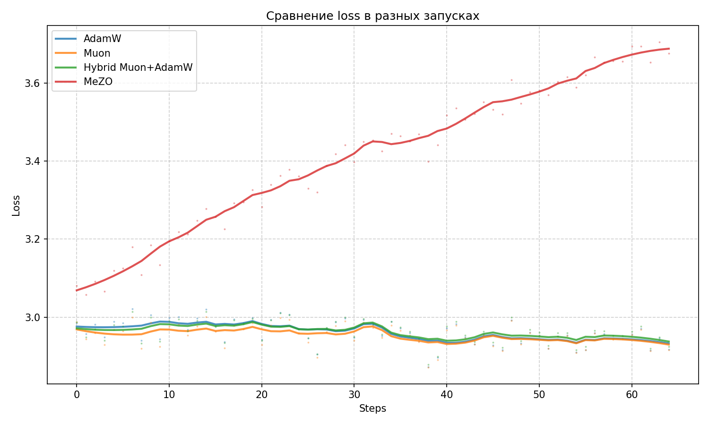
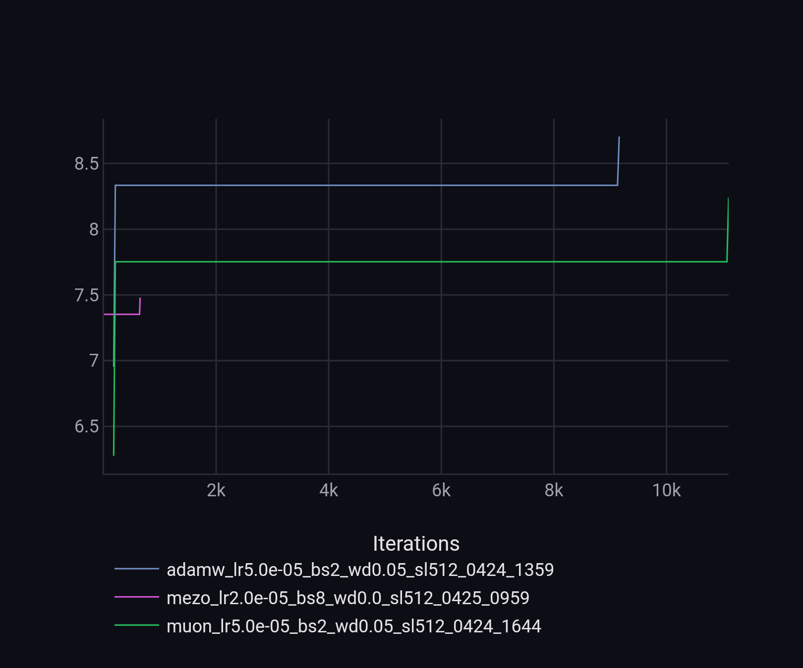

# Сравнение оптимзаторов для полного дообучения Qwen2.5-0.5B

## 📌 Обзор

Данный проект реализует **полное дообучение (full fine-tuning)** языковой модели **Qwen2.5-0.5B** на датасете **openwebtext-100k** (были. взяты первые 10k семплов) с использованием трех стратегий оптимизации:

- **AdamW** – классический адаптивный оптимизатор (базовый уровень).
- **Muon** – новый оптимизатор на основе ортогонализации матриц (обещает 2× ускорение сходимости).
- **MeZO** *(Challenge)* – zeroth-order оптимизатор, оценивающий градиент без обратного распространения (только два forward-прохода на шаг).

**Цель:** сравнить оптимизаторы по времени обучения, пиковому потреблению памяти, loss и итоговому качеству на стандартных бенчмарках: `PIQA`, `ARC-easy`, `ARC-challenge`, `WinoGrande`, `HellaSwag`.

# 📄 Информация для ревьюера

**Контекст:** тестовое задание на позицию *Senior Research Engineer*.

---

## 🔗 Материалы

- 📘 LaTeX-отчёт (PDF): `docs/report.pdf`  
- 📝 Исходник отчёта (LaTeX): `docs/report.tex`  
- 💻 Код и скрипты обучения: `src/`, `scripts/`  
- 📊 Логи и графики: `docs/`  
- 🌐 GitHub-репозиторий: https://github.com/Se1ecta/huawei-research  

---

## 🤗 Обученные модели (Hugging Face Hub)

- **AdamW:**  
  https://huggingface.co/Neira/Qwen2.5-0.5B_adamw_v2  

- **Muon:**  
   https://huggingface.co/Neira/Qwen2.5-0.5B_muon_v2_simple  
   

- **Hybrid Muon+AdamW:** 
   https://huggingface.co/Neira/Qwen2.5-0.5B_muon_v2 
  

- **MeZO:**  
  https://huggingface.co/Neira/Qwen2.5-0.5B_mezo_v2  

---

## 📈 Логи экспериментов (ClearML)

Все эксперименты доступны в ClearML (метрики, логи, конфигурации, использование GPU-памяти):

- **AdamW:**  
  https://app.clear.ml/projects/e0a00fcf9bd44538a94d4e30a10713a1/experiments/5821023a9f524a60a1dc3eec5a925ae2/output/execution  

- **Muon (simple):**  
  https://app.clear.ml/projects/e0a00fcf9bd44538a94d4e30a10713a1/experiments/0c9b58d07d234a9d8bd8fbbac8d06010/output/execution  

- **Muon (Hybrid):**  
  https://app.clear.ml/projects/e0a00fcf9bd44538a94d4e30a10713a1/experiments/a6be468a9d9245d8ab30baccbe1e1ba1/output/execution  

- **MeZO:**  
  https://app.clear.ml/projects/e0a00fcf9bd44538a94d4e30a10713a1/experiments/9d6bf012b1914e2eab0549d40ac38dfc/output/execution

> ClearML содержит:
> - графики обучения
> - step-level loss  
> - learning rate   
> - GPU memory usage  
> - полную конфигурацию запуска  


## 📓 Запуск в Google Colab / Kaggle (без локальной установки)

В репозитории подготовлен ноутбук **`notebooks/ExperimentRun.ipynb`**, который автоматически:
- Определяет среду (Colab/Kaggle/local)
- Монтирует Google Drive (при необходимости)
- Клонирует репозиторий и устанавливает зависимости
- Настраивает ClearML через Colab Secrets / Kaggle Secrets
- Запускает **серию экспериментов** (AdamW, Muon, Hybrid, MeZO) с заданными конфигурациями
- После обучения запускает **оценку моделей** через `lm-evaluation-harness` (PIQA, ARC, WinoGrande, HellaSwag)
- Строит сводную таблицу и график сравнения

## 🚀 Быстрый старт

### Требования
- Python 3.10+
- GPU с 12+ GB VRAM
- Установленные CUDA и PyTorch 2.0+

### Установка

#### Способ 1: Poetry (рекомендуется для воспроизводимости)
```bash
git clone https://github.com/Se1ecta/huawei-research.git
cd huawei-research
poetry install
poetry shell
```

#### Способ 2: pip + requirements.txt
```bash
git clone https://github.com/Se1ecta/huawei-research.git
cd huawei-research
pip install -r requirements.txt
```


## 🔐 Настройка переменных окружения

Для локального запуска экспериментов (через скрипты `scripts/*.sh`) рекомендуется использовать файл `.env` для хранения sensitive данных (ключи ClearML, Hugging Face токен).

1. Скопируйте шаблон:
   ```bash
   cp .env.example .env
   ```

2. Отредактируйте `.env`:


3. Загрузите переменные в окружение перед запуском:
   ```bash
   source .env
   # или используйте python-dotenv внутри скриптов
   ```

#### Настройка ClearML (опционально, для отслеживания экспериментов)
```bash
clearml-init
```
Или установите переменные окружения:
```bash
export CLEARML_API_ACCESS_KEY="..."
export CLEARML_API_SECRET_KEY="..."
```

#### Авторизация Hugging Face Hub (для пуша моделей)
```bash
huggingface-cli login
```

---

## 🏃 Запуск экспериментов

Все скрипты запуска находятся в папке `scripts/`. Примеры:

### AdamW (базовый)
```bash
bash scripts/run_adamw.sh
```
Содержимое `run_adamw.sh`:
```bash
python src/train.py \
  --model_name Qwen/Qwen2.5-0.5B \
  --optimizer adamw \
  --per_device_train_batch_size 2 \
  --gradient_accumulation_steps 8 \
  --learning_rate 3e-4 \
  --seq_length 512 \
  --num_train_epochs 1 \
  --lr_scheduler_type cosine \
  --warmup_ratio 0.01 \
  --weight_decay 0.01 \
  --logging_steps 10 \
  --push_to_hub True \
  --report_to clearml \
  --seed 42 \
  --output_dir ./Qwen2.5-0.5B_adamw
```

### Muon
```bash
bash scripts/run_muon.sh
```

### MeZO (Zeroth‑order)
```bash
bash scripts/run_mezo.sh
```

> **Примечание:** Для MeZO рекомендуется увеличить `zo_eps` (например, `--zo_eps 1e-3`) и возможно снизить `learning_rate`.

---


### Как использовать ноутбук:

1. Откройте [Google Colab](https://colab.research.google.com/)  
2. Загрузите ноутбук: `File → Upload notebook` → выберите `notebooks/ExperimentRun.ipynb`  
3. Включите GPU: `Runtime → Change runtime type → T4 GPU`  
4. (Рекомендуется) Добавьте секреты:
   - `CLEARML_API_ACCESS_KEY` и `CLEARML_API_SECRET_KEY` (для трекинга)
   - `HF_TOKEN` (опционально, для пуша модели на Hub)  
5. Запустите ячейки и заполните неоюходимые данные.


---

## ⚙️ Параметры экспериментов

| Параметр            | Значение                              |
|---------------------|---------------------------------------|
| Модель              | `Qwen/Qwen2.5-0.5B`                   |
| Датасет             | `Elriggs/openwebtext-100k` (10k samples) |
| Оценка              | `lm-evaluation-harness` |
| Batch size          | 2 (gradient accumulation = 8) → эфф. batch 16 |
| Эпохи               | 1                                     |
| Длина последовательности | 512                              |
| Точность            | `float32`  |
| GPU                 | NVIDIA T4 (15GB) / V100 / A10         |
| LR scheduler        | cosine с warmup ratio 0.01            |
| Weight decay        | 0.01 |

---

## 🧪 Методы

### 1. AdamW
- Реализация `torch.optim.AdamW`

### 2. Muon
- Исходный код: [Moonlight](https://github.com/MoonshotAI/Moonlight)
- Особенности: Newton-Schulz итерации для ортогонализации градиента, адаптивное масштабирование


### 3. MeZO (Zeroth-Order)
- Реализация на основе [Princeton-NLP/MeZO](https://github.com/princeton-nlp/MeZO), адаптированная для `transformers>=5.0`
- Требует два forward-прохода на шаг, **без backward** → экономия памяти на градиентах.


---

# 📊 Результаты

Эксперименты проводились на **2xNVIDIA T4 (15GB)**, 1 эпоха, 625ыеузы, effective batch size = 16.

Интерпретация результатов представлена в `docs/report.pdf`, здесь отображены только финальные результаты.

---

### Сводная статистика loss

| Optimizer | Initial | Min | Max | Final |
|------------|---------|------|------|--------|
| **AdamW** | 2.985 | **2.872** | 3.020 | 2.916 |
| **Muon** | 2.987 | 2.871 | **3.000** | **2.915** |
| Hybrid (Muon+AdamW) | 2.987 | 2.878 | 3.014 | 2.923 |
| MeZO | 3.080 | 3.057 | 3.705 | 3.675 |

---

## Эффективность обучения

| Optimizer | Final Loss | Time (hrs) | Peak Memory (GB) |
|------------|------------|------------|------------------|
| AdamW | 2.916 | 2.5 | 8.705 |
| Muon | 2.915 | 3.2 | 7.660 |
| Hybrid | 2.923 | 3.0 | 8.240 |
| MeZO | 3.675 | **1.7** | **7.479** |

---

#### Время обучения

- AdamW — 2.5 часа  
- Muon — 3.2 часа (+28%)  
- Hybrid — 3.0 часа  
- MeZO — 1.7 часа (самый быстрый)

---

# Downstream Task Performance

Оценка проводилась через `lm-evaluation-harness` (zero-shot).

## Zero-shot Accuracy

| Model | PIQA | ARC-E | ARC-C | WinoGrande | HellaSwag | Avg |
|--------|------|--------|--------|------------|------------|--------|
| Base (Qwen2.5-0.5B) | 0.7051 | 0.6465 | 0.2910 | 0.5643 | 0.4059 | 0.5226 |
| AdamW | 0.7035 | 0.6667 | 0.2961 | 0.5683 | 0.3982 | 0.5266 |
| Muon | 0.7029 | 0.6654 | 0.2909 | 0.5674 | 0.3989 | 0.5251 |
| Hybrid | 0.7013 | 0.6671 | 0.3003 | 0.5596 | 0.4006 | 0.5258 |
| MeZO | 0.6382 | 0.5370 | 0.2619 | 0.5351 | 0.3592 | 0.4663 |

---

---


### График функции потерь



### График использования VRAM (gb)


---

## 🛠 Структура проекта

```
huawei-research/
├── docs/                     # документация проекта
├── notebooks/
│   └── ExperimentRun.ipynb   # автоматизированный ноутбук для Colab/Kaggle
├── scripts/
│   ├── run_adamw.sh
│   ├── run_muon.sh
│   └── run_mezo.sh
├── src/
│   ├── train.py                # основной скрипт обучения
│   ├── optimizers/             # реализации Muon
│   ├── mezo/                   # реализации Mezo
├── requirements.txt
├── pyproject.toml
└── README.md
```
---

# ✅ Соответствие техническому заданию

- Выполнен **full fine-tuning** модели `Qwen2.5-0.5B`
- Датасет: `openwebtext-100k` (использован поднабор 10k из‑за ограничений вычислительной среды и времени использования)  
- Реализованы оптимизаторы: **AdamW, Muon, Hybrid (Muon+AdamW), MeZO**   
- Метрики: **training loss, время обучения, пик использования GPU-памяти**  
- Оценка через **LM Evaluation Harness** (PIQA, ARC-E, ARC-C, WinoGrande, HellaSwag)  
- Логирование loss на каждом шаге и построение графиков (ClearML)  
- Скрипты для воспроизводимости
- Подготовлен отчёт в LaTeX с анализом результатов  
- Код опубликован в публичном GitHub-репозитории  
---
